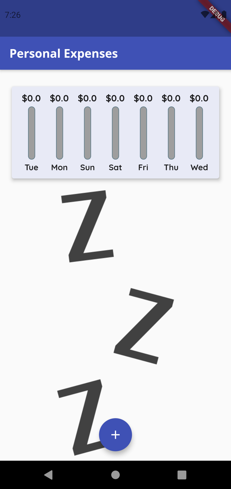
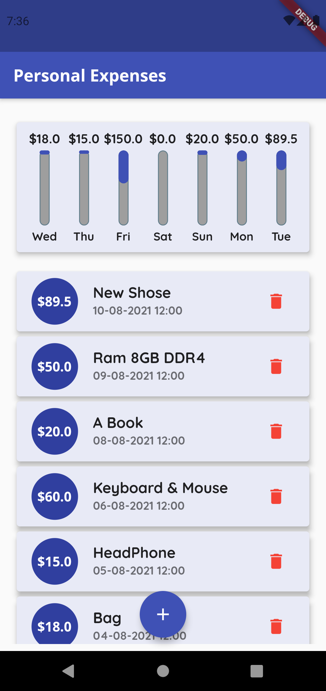

# Personal_Expenses (Flutter - Dart)
<strong> Adding daily expenses with specified date and see weekly chart of your expenses according to the amount. </strong>

## Screenshoots

###  => Empty expenses list

###  => Adding a new transaction

###  => Home Screen with chart

  </img>

